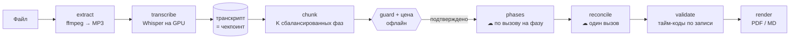

# EchoGist

[](https://github.com/VNQuq/echogist/actions/workflows/ci.yml)

Многочасовую лекцию или созвон долго пересматривать, а короткий пересказ от нейросети
легко теряет или додумывает то, что автор на самом деле сказал. **EchoGist** — консольное
приложение для Windows: оно локально расшифровывает запись на видеокарте и собирает по ней
структурированное резюме, в котором каждый тайм-код проверен по самой записи.


> **Плейсхолдер (GIF).** Здесь будет короткая запись консоли: выбор файла → транскрипция →
> оценка цены → готовое резюме.
>
> **Плейсхолдер (пример резюме).** Здесь будет ссылка на PDF/MD, собранный из синтетической
> записи.

## Что делает

- **Вход:** локальный аудио-/видеофайл, сохранённый транскрипт или целая папка с записями.
- **Выход:** MP3-дорожка и/или резюме в PDF или Markdown (RU или EN).
- **Резюме:** связная проза по ходу записи с тайм-кодами `[ЧЧ:ММ:СС]` внутри текста, блок
  сути (главная мысль, главный навык, три проверочных вопроса с ответами в конце документа),
  сквозные темы, а если они были — решения и пункты к выполнению.
- **Приватность:** транскрипция локальная (Whisper на GPU), в облако уходит только текст
  транскрипта на резюмирование. Без логинов, онлайн-источников и истории.

## Архитектура



- **Деньги тратятся только в двух узлах со значком ☁:** по вызову Anthropic на каждую фазу и
  один сводящий вызов. Всё левее — локально и офлайн, включая проверку длины и оценку цены.
- **Гейты:**
  - **до сети:** `guard` отсекает транскрипт, который не влезет в контекст модели;
    оценка цены сравнивается с порогом подтверждения (по умолчанию $0.50). Для папки —
    одна цена и один вопрос на весь прогон;
  - **после сети:** каждый тайм-код сверяется с реальными блоками транскрипта; пустая фаза
    роняет файл; неполный сводящий ответ, чужая письменность и документ не на том языке
    печатаются громко.
- **Фазы идут последовательно и только вперёд:** каждая видит заголовки предыдущих и хвост
  их прозы, чтобы не повторяться. Сводящий вызов работает по прозе фаз и транскрипт заново
  не читает.
- **Восстановление по артефактам, а не job-движок:** сохранённый транскрипт — это
  чекпоинт, а фазы, дошедшие до конца, лежат на диске. Повторный запуск не платит за них
  второй раз.

## Инженерные решения

1. **Запись узнаётся по содержимому, а не по имени** — [TD-31](docs/TECHNICAL_DEBT.md),
   [`dbdda98`](https://github.com/VNQuq/echogist/commit/dbdda98). Отпечаток — `sha256` от
   размера и первого/последнего мегабайта. Переименование или перенос файла ничего не
   стоит, а два курса с одинаковыми именами файлов (`Лекция 1.mp4`) никогда не делят один
   транскрипт и не получают чужое оплаченное резюме.
2. **Атомарная запись каждого артефакта** —
   [`10a40d1`](https://github.com/VNQuq/echogist/commit/10a40d1). Сначала `.part`, потом
   `os.replace`. Обрезанный при `kill -9` транскрипт выглядел бы корректным чекпоинтом и
   купил бы резюме половины лекции без единой ошибки; `.part` оставляет мусор, а не
   поддельный артефакт.
3. **Цена известна до оплаты** —
   [`1773b73`](https://github.com/VNQuq/echogist/commit/1773b73),
   [`e1aca33`](https://github.com/VNQuq/echogist/commit/e1aca33). Оценка токенов локальная и
   зависит от письменности (кириллица считается дороже, всё округляется вверх). Отчёт по
   папке называет цену ещё до вопроса «что сделать».
4. **Тайм-коды проверяются по записи** —
   [`7ad2185`](https://github.com/VNQuq/echogist/commit/7ad2185). Каждый `[ЧЧ:ММ:СС]` в
   прозе, заголовках и блоке сути либо совпадает с реальным блоком транскрипта, либо
   сдвигается к ближайшему в пределах 2 секунд, либо выбрасывается. Ложной координаты в
   документе не остаётся, а число выброшенных печатается.
5. **Пустая фаза — громкий отказ, а не тихая дыра** — [TD-34](docs/TECHNICAL_DEBT.md),
   [`5539ee9`](https://github.com/VNQuq/echogist/commit/5539ee9),
   [`9ccdf47`](https://github.com/VNQuq/echogist/commit/9ccdf47). Фаза, вернувшаяся без
   текста, роняет файл, иначе её кусок записи молча выпал бы из документа. После прогона
   EchoGist один раз предлагает повторить только упавшие файлы и платит только за пропавшую
   фазу.
6. **Пороги откалиброваны на реальных данных** — [TD-33](docs/TECHNICAL_DEBT.md),
   [`e3bc2b2`](https://github.com/VNQuq/echogist/commit/e3bc2b2); [TD-30](docs/TECHNICAL_DEBT.md),
   [`f94d6b0`](https://github.com/VNQuq/echogist/commit/f94d6b0). Детектор зацикливания
   Whisper измеряет форму повтора (покрытие 3-граммами), а не словарь: прежнее правило на 13
   лекциях удалило 39 блоков живой речи (5172 слова), новое ловит те же 18 петель без
   потерь. Порог «документ не на том языке» (0.25) выбран по замерам: у шести реальных
   документов доля чужой письменности 0.0013–0.0088, при полной смене языка — больше 0.95.

## Как ведётся разработка

Проект сделан с помощью AI, и это не скрывается. **Автор** отвечает за требования,
архитектуру, ревью и приёмку. **Агент** (Claude Code) пишет код по правилам из
[`CLAUDE.md`](CLAUDE.md). Каждое изменение проходит один и тот же гейт — `ruff`,
`ruff format`, `mypy` (strict), `pytest` — локально и в CI на Windows и Linux. Соавторство
видно в истории: трейлеры `Co-Authored-By` в коммитах.

Два файла задают рамку работы (оба на английском):

- **[`CLAUDE.md`](CLAUDE.md)** — правила и ограничения для агента: что запрещено без
  согласования, какие принципы нельзя нарушать, как устроен релиз и что делать при
  конфликте документов.
- **[`docs/CURRENT_CONTEXT.md`](docs/CURRENT_CONTEXT.md)** — живое состояние проекта:
  инварианты, которые легко сломать незаметно, и следующие шаги. Лимит — около 88 строк,
  обновляет его агент по
  [протоколу](CLAUDE.md#state-update-protocol): добавлять и сокращать в одной правке,
  хранить только то, чего нет в коде и CHANGELOG.

Принципы, которые из них видны:

- **Платное действие — только через гейт.** Единственный сетевой шаг — резюме; всё до него
  офлайн, а весь конвейер обязан проходить на заглушке вместо API до каждого пуша
  ([Hard Constraints → Killswitch](CLAUDE.md#hard-constraints)).
- **Пороги измеряются, а не выбираются.** Коэффициенты цены переснимаются из строки
  «Actual cost» реальных прогонов, пороги детекторов — по реальным документам
  ([CURRENT_CONTEXT → Live invariants](docs/CURRENT_CONTEXT.md), TD-30 и TD-33 в
  [реестре](docs/TECHNICAL_DEBT.md)).
- **Решение записывается вместе с отвергнутой альтернативой.** Принцип «верность важнее
  полноты» прямо указывает, какие прежние правила он отменил
  ([Principles](CLAUDE.md#principles)); закрытые записи техдолга объясняют, почему выбран
  более дешёвый вариант.
- **Техдолг — с триггером, а не «когда-нибудь».** У каждой открытой записи есть дата или
  условие, при котором к ней возвращаются ([реестр техдолга](docs/TECHNICAL_DEBT.md), на
  английском).
- **Громкий отказ вместо тихого пропуска.** Любая ошибка — понятное сообщение и возврат в
  меню, никакого молчаливого обрезания ([Principles](CLAUDE.md#principles)).

## Требования

| Требование | Примечание |
|---|---|
| Windows + **Python 3.11.x** в PATH | строго `3.11.` |
| GPU NVIDIA + CUDA | локальный Whisper |
| Ключ Anthropic | только для резюме (`ANTHROPIC_API_KEY` или `config/secrets.toml`) |

ffmpeg в комплекте (`imageio-ffmpeg`) — ставить не нужно.

## Быстрый старт

```bat
run.bat
```

Первый запуск сам готовит окружение, ставит зависимости из хэш-закреплённого
`requirements.lock` и один раз скачивает модель Whisper. Дальше запуск идёт сразу в меню.

📖 Гайд: [docs/USAGE.md](docs/USAGE.md) · 📋 Изменения: [CHANGELOG.md](CHANGELOG.md)

## Статус

Версия **3.1.0**, личный инструмент одного автора, в работе. Около 800 тестов проходят без
GPU, модели, сети и ключа, поэтому CI гоняет их на Windows и Linux на каждый PR.

## Известные ограничения

- Только Windows и только NVIDIA: приложение и его установщик рассчитаны на одну машину.
- Полнота резюме проверяется вручную, по записи: автоматического сигнала покрытия нет,
  автоматически проверяются только тайм-коды.
- Сводящий вызов иногда возвращает неполный блок сути (например, без заголовка). Это
  печатается громко, но не исправляется само — открытая запись TD-36.
- Первая загрузка модели идёт с Hugging Face; без доступа к нему модель придётся положить
  вручную.

Открытый техдолг с триггерами — в [docs/TECHNICAL_DEBT.md](docs/TECHNICAL_DEBT.md) (на
английском).

## Лицензия

[MIT](LICENSE). Шрифты DejaVu в `echogist/assets/fonts/` — под своей лицензией.
