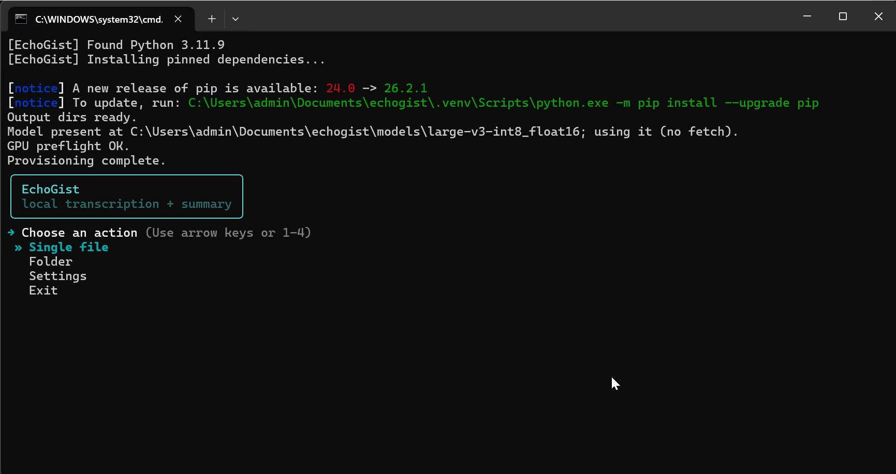
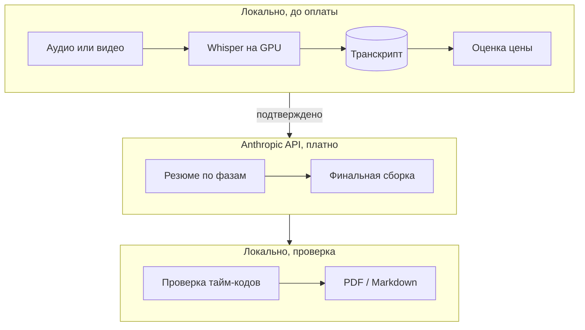

# EchoGist

[](https://github.com/VNQuq/echogist/actions/workflows/ci.yml)

Многочасовую запись долго пересматривать, а короткий пересказ от нейросети может потерять
или додумать сказанное. EchoGist расшифровывает запись локально на видеокарте и собирает по
ней резюме, в котором каждый тайм-код сверен с транскриптом.

*A Windows console tool: local GPU Whisper transcription, then a phase-by-phase Claude
summary whose every timecode is checked against the transcript.*



## Что делает

| Вход | Что можно получить |
|---|---|
| Видео или аудио не в MP3 | MP3 · транскрипт · резюме |
| MP3 | транскрипт · резюме · пережатый MP3 поменьше |
| Сохранённый транскрипт | резюме без повторной транскрипции |
| Папка с подпапками | те же действия для всех записей, одна оценка стоимости на весь прогон |

Резюме — связная проза по ходу записи с тайм-кодами, блок сути (главная мысль, главный навык,
три проверочных вопроса) и сквозные темы; на русском или английском, в PDF или Markdown.

**Стек:** Python 3.11 · faster-whisper (CTranslate2, CUDA) · Anthropic SDK · ffmpeg
(imageio-ffmpeg) · fpdf2 · rich + questionary · pytest, mypy (strict), ruff · GitHub Actions.

## Архитектура



- **Граница оплаты:** платные только вызовы Anthropic — по одному на фазу и один на финальную сборку.
- **Транскрипт — чекпоинт:** сохраняется до первого платного вызова; фазы, завершённые до
  сбоя, повторно не оплачиваются. Транскрипт, JSON резюме и MP3 пишутся через `.part` +
  `os.replace`, так что обрыв не оставит обрезанный файл. Запись узнаётся по отпечатку
  содержимого, а не по имени ([TD-31](docs/TECHNICAL_DEBT.md)).
- **Фазы по очереди:** каждая видит заголовки предыдущих и конец текста предыдущей фазы;
  финальная сборка пишет заголовок и блок сути по тексту фаз, не перечитывая транскрипт.

## Инженерные решения

1. **Стоимость оценивается до оплаты.** Проблема: длинная запись обходится дороже
   ожидаемого, а подтверждать каждый файл папки нельзя. Решение: локальная оценка токенов с
   учётом алфавита и округлением вверх, отказ, если транскрипт не влезет в контекст, и
   подтверждение выше порога ($0.50), для папки — одно на прогон. Цена: оценка консервативна
   и может отличаться от счёта. → [`guard.py`](echogist/guard.py),
   [`cost.py`](echogist/cost.py), [TD-35](docs/TECHNICAL_DEBT.md)
2. **Пустая фаза — ошибка, а не пробел.** Проблема: фаза без текста оставила бы в документе
   дыру при «успешном» прогоне. Решение: файл останавливается с ошибкой, готовые фазы
   сохраняются, после прогона EchoGist предлагает повтор. Цена: повтор оплачивает пропавшую
   фазу. → [`summarize.py`](echogist/summarize.py), [TD-34](docs/TECHNICAL_DEBT.md)
3. **Тайм-коды сверяются с транскриптом.** Проблема: модель может сослаться на момент,
   которого нет. Решение: тайм-код в прозе, заголовках и блоке сути либо совпадает с блоком
   транскрипта, либо сдвигается к ближайшему в пределах 2 секунд, либо удаляется с
   предупреждением. Цена: проверяется, что момент существует, а не что текст о нём.
   → [`summarize.py`](echogist/summarize.py), [TD-16](docs/TECHNICAL_DEBT.md)
4. **Пороги измерены на реальных данных.** Проблема: Whisper зацикливается на фразе, а
   лектор повторяет фразы намеренно — прежнее правило удаляло живую речь. Решение: детектор
   меряет форму повтора и на реальных записях ловит те же петли без потери речи; порог
   «резюме не на том языке» выбран по доле символов другого алфавита. Цена: пороги сняты на
   материале одного автора. → [`chunk.py`](echogist/chunk.py),
   [`alphabet.py`](echogist/alphabet.py), [TD-33, TD-30](docs/TECHNICAL_DEBT.md)

## Как ведётся разработка

Проект сделан с помощью AI: автор отвечает за требования, архитектуру, ревью и приёмку,
агент (Claude Code) пишет код по правилам [`CLAUDE.md`](CLAUDE.md), текущее состояние живёт
в [`docs/CURRENT_CONTEXT.md`](docs/CURRENT_CONTEXT.md) (оба на английском). Соавторство видно
по трейлерам `Co-Authored-By`.

- **Платный вызов только через killswitch:** весь конвейер обязан проходить на заглушке
  вместо API ([Hard Constraints](CLAUDE.md#hard-constraints)).
- **Решение записывается вместе с тем, что оно отменяет** ([Principles](CLAUDE.md#principles)).
- **У техдолга есть триггер:** дата или условие, при котором к записи возвращаются
  ([реестр](docs/TECHNICAL_DEBT.md), на английском).

## Качество и проверка

CI гоняет `ruff`, `ruff format`, `mypy` (strict) и `pytest` на Windows и Linux, Python 3.11.
Тестам не нужны GPU, модель, сеть и ключ. На чистом клоне:

```bash
python -m pip install --require-hashes -r requirements.lock -r requirements-dev.lock
ruff check . && ruff format --check . && mypy && pytest
```

Lock включает CUDA-колёса (~2,6 ГБ). Читать код стоит с
[`summarize.py`](echogist/summarize.py), [`chunk.py`](echogist/chunk.py),
[`guard.py`](echogist/guard.py) и [`folder.py`](echogist/folder.py).

## Запуск

Нужны Windows, Python 3.11.x, GPU NVIDIA с CUDA и ключ Anthropic (только для резюме).

```bat
run.bat
```

Первый запуск сам ставит зависимости и скачивает модель Whisper.
Подробно: [docs/USAGE.md](docs/USAGE.md) · изменения: [CHANGELOG.md](CHANGELOG.md).

## Ограничения и что дальше

- Только Windows и NVIDIA.
- Полнота и верность содержания проверяются вручную; автоматически — только тайм-коды.
- Сводящий вызов иногда возвращает неполный блок сути; выводится предупреждение, причина
  ещё ищется ([TD-36](docs/TECHNICAL_DEBT.md)).
- Ветки кода только для Windows не проверяются mypy ([TD-37](docs/TECHNICAL_DEBT.md)).

## Статус и лицензия

Версия 3.1.1 (2026-09-25).
Лицензия [MIT](LICENSE); у шрифтов DejaVu в `echogist/assets/fonts/` своя лицензия.
