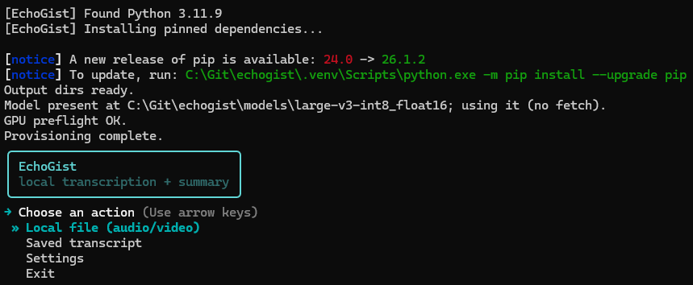
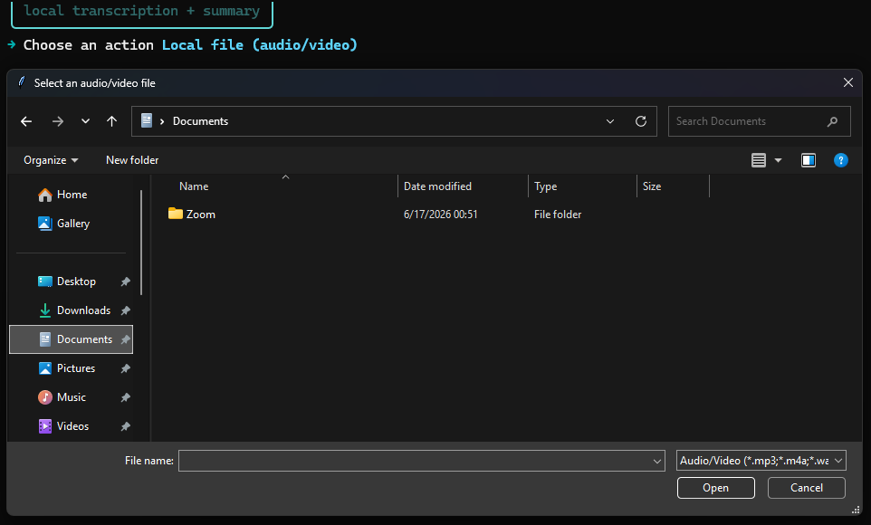
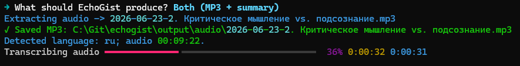
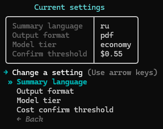

# Как пользоваться EchoGist

Гайд от «только что скачал» до «получил резюме». EchoGist берёт локальный аудио/видео
файл (или сохранённый транскрипт) и делает MP3-дорожку и/или структурированное резюме
(PDF или Markdown).

## Что нужно до первого запуска

- **Windows** + **Python 3.11.x** в PATH (именно 3.11 — `run.bat` другие версии не примет).
- **ffmpeg** ставить не нужно — он идёт в комплекте (`imageio-ffmpeg`).
- **GPU NVIDIA** с CUDA — на нём работает Whisper.
- **Ключ Anthropic** — только для резюме. Один из двух способов: переменная
  `ANTHROPIC_API_KEY` **или** файл `config/secrets.toml` (скопируй
  `config/secrets.toml.example`, впиши ключ в `anthropic_api_key`). Без ключа MP3 и
  транскрипция всё равно работают — не запустится только резюме.

## Первый запуск

```bat
run.bat
```

Первый запуск сам всё готовит: Python, виртуальное окружение, зависимости, папки `output/`,
**один раз качает модель Whisper** (несколько ГБ с Hugging Face) и проверяет GPU. Это требует
интернета и времени; дальше модель берётся локально и запуск идёт сразу к меню.

> Если окно закрылось с ошибкой — читай сообщение над строкой `Startup aborted`. Окно ждёт
> нажатия клавиши, не пропадает мгновенно.

## Главное меню

Двигайся **стрелками ↑/↓**, выбирай **Enter**. В подменю есть **← Back** (шаг назад);
**ESC и Ctrl-C выходят из приложения целиком**, а не «назад».



- **1. Local file** — взять локальный аудио/видео файл.
- **2. Saved transcript** — пере-резюмировать сохранённый транскрипт.
- **3. Settings** — язык, формат, модель, порог стоимости.
- **4. Exit** — выход.

## Сценарий 1: видео/аудио → MP3 и/или резюме

Выбери **Local file**. Откроется системное окно выбора файла (в первый раз — на `Загрузки`,
потом запоминает последнюю папку).



Дальше EchoGist спросит, что сделать:

- **Summary** — резюме (транскрипция + один облачный вызов).
- **MP3 only** — только дорожка в MP3.
- **Both** — и то, и другое.

Если файл **уже MP3**, конвертировать нечего — предложат **Summary** или **Transcript only**
(остановиться на сохранённом транскрипте без облачного вызова).

И при конвертации в MP3, и при транскрипции показывается полоса с процентом и оставшимся
временем:



Перед оплачиваемым вызовом EchoGist показывает **оценку стоимости**. Дороже порога
(по умолчанию $0.50) — спросит y/n; дешевле — идёт сразу. После ответа модели видна
фактическая стоимость и путь к готовому файлу.

Когда результат готов, EchoGist один раз за запуск открывает нужную папку в Explorer (в фоне,
не перехватывая фокус у консоли): `output/audio` после **MP3 only**, `output/transcripts` после
транскрипции.

## Сценарий 2: готовый транскрипт → резюме

Путь восстановления. Если резюме когда-то не удалось (пропал интернет, не было ключа),
транскрипт уже сохранён — выбери **Saved transcript** и пере-резюмируй его **без повторной
транскрипции**. Файл берётся из списка `output/transcripts/` или вписывается вручную.

## Где лежат результаты

```
output/
├── audio/            # извлечённые MP3
├── transcripts/      # полные транскрипты (.txt) — это и есть «чекпоинт»
└── summaries/        # готовые резюме (.pdf / .md)
    └── raw/          # сырой .json (для повторного рендера без оплаты)
```

## Настройки

Меню **Settings** меняет четыре параметра, сохраняя их в `config/settings.json`:



- **Summary language** — `ru` или `en` (по умолчанию `ru`).
- **Output format** — `pdf` или `md` (по умолчанию `pdf`).
- **Model tier** — какая модель резюмирует (по умолчанию `economy`):

  | Tier | Модель | Контекст | Цена (вход / выход за 1М токенов) |
  |------|--------|----------|-----------------------------------|
  | `economy` | Haiku | 200K | $1 / $5 |
  | `balanced` | Sonnet | 1M | $3 / $15 |
  | `flagship` | Opus | 1M | $5 / $25 |

- **Cost confirm threshold** — выше этой суммы спрашивается подтверждение (по умолчанию $0.50).

> Модели, цены и текст промпта — данные, а не код: правятся в `config/models.toml`.

## Если что-то пошло не так

EchoGist никогда не падает молча: при ошибке печатает понятное сообщение и возвращает в меню.

| Сообщение | Что делать |
|-----------|------------|
| **«No Anthropic API key found» (F3)** | Задай `ANTHROPIC_API_KEY` или заполни `config/secrets.toml`, перезапусти. Транскрипт уже сохранён — пере-резюмируй из пункта **2**. |
| **«This transcript is too long…» (F6)** | Не влезает в один проход. В **Settings** выбери модель с бóльшим контекстом (`balanced`/`flagship`). Оплаты не было. |
| **Модель «висит» или падает при загрузке** | Нет связи с Hugging Face (бывает нужен VPN). Дождись интернета и перезапусти, либо положи файлы модели в `models/large-v3-int8_float16/` вручную. |
| **«Python is not on PATH» / «needs 3.11.x»** | Поставь Python 3.11 с python.org, перезапусти. |
| **Не находит ffmpeg** | Добавь ffmpeg в PATH или положи рядом с приложением. |

---

См. также: [README](../README.md) — краткий обзор и возможности.
