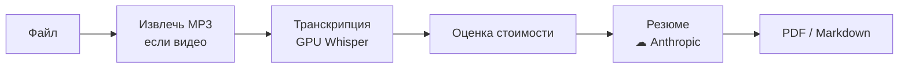

# Как пользоваться EchoGist

## Что это

Консольный инструмент для Windows. На входе — аудио- или видеофайл либо сохранённый
транскрипт. На выходе — MP3 и/или резюме в PDF или Markdown.

Транскрипция идёт локально на видеокарте, резюме собирает Anthropic — это один облачный
вызов. Без логинов, истории и онлайн-источников.

## Что нужно

| Требование | Зачем |
|---|---|
| **Windows** | целевая платформа |
| **Python 3.11.x** в PATH | другую версию `run.bat` отклонит |
| **GPU NVIDIA + CUDA** | локальная транскрипция |
| **Ключ Anthropic** | только для резюме |

ffmpeg ставить не нужно — он в комплекте.

Ключ задаётся одним из двух способов: переменная окружения `ANTHROPIC_API_KEY` или файл
`config/secrets.toml` (скопируй `config/secrets.toml.example` и впиши ключ в
`anthropic_api_key`).

> **Note** — без ключа MP3 и транскрипция работают. Не запустится только резюме.

## Первый запуск

```bat
run.bat
```

Первый запуск готовит всё сам: окружение, зависимости, папки `output/` и загрузку модели
Whisper (несколько ГБ). Нужны интернет и время. Дальше запуск идёт сразу в меню.

> **Warning** — если закрылось с ошибкой, читай сообщение над строкой `Startup aborted`.
> Окно ждёт нажатия клавиши и не пропадает мгновенно.

## Как устроен прогон



Сетевой шаг только один — резюме. Всё остальное, включая оценку стоимости, происходит на
твоей машине. Сохранённый транскрипт подставляется вместо шагов A–C, поэтому повторное
резюме начинается сразу с оценки.

## Главное меню

**↑/↓** двигают, **Enter** выбирает, цифра выбирает строку по номеру, **← Back** — шаг
назад. **ESC** и **Ctrl-C** выходят из приложения; единственное исключение — массовая
конвертация (см. ниже).


| Пункт | Действие |
|---|---|
| **Local file** | взять локальный аудио/видео файл |
| **Batch: videos → MP3** | сконвертировать в MP3 сразу пачку файлов |
| **Saved transcript** | пере-резюмировать сохранённый транскрипт |
| **Settings** | язык, формат, модель, порог стоимости, воркеры |
| **Exit** | выход |

## Резюме или MP3 из одного файла

1. Выбери **Local file** и укажи файл в системном окне (оно помнит последнюю папку).
2. Выбери действие. Для **видео** MP3-дорожка сохраняется в любом случае:

   | Действие | Что сохраняет |
   |---|---|
   | **MP3 only** | только MP3 |
   | **Summary** | MP3 + резюме + транскрипт |
   | **Transcript** | MP3 + транскрипт, без облачного вызова |

   Если на входе уже MP3, вариантов два: **Summary** или **Transcript only**.

3. Извлечение MP3 и транскрипция показывают процент и оставшееся время.
4. Подтверди стоимость. Дороже порога (`$0.50`) — спросит `y/n`, дешевле — пойдёт сразу.

В конце EchoGist один раз открывает папку с результатом — резюме, если оно есть, иначе
транскрипт, иначе аудио.

> **Note** — на ветках Summary и Transcript сбой извлечения MP3 не фатален: будет
> предупреждение, и прогон продолжится. Для **MP3 only** сбой возвращает в меню.

## Массовая конвертация видео в MP3

Когда нужно вытащить звук сразу из пачки записей. Шаг офлайновый и бесплатный: только MP3,
без транскрипции и резюме.

1. Выбери **Batch: videos → MP3**.
2. В системном окне отметь файлы: **Shift+клик** — диапазон, **Ctrl+клик** — поштучно,
   **Ctrl+A** — всё видимое.
3. Если среди выбранного попадутся готовые MP3, EchoGist один раз спросит, перекодировать
   ли их тоже. По умолчанию **нет**: перекодировка только теряет качество, а выделение
   диапазоном легко цепляет лишнее. Осознанно сжать MP3 можно через **Local file →
   Re-encode to a smaller MP3**.
4. Полоса прогресса считает файлы, а не проценты внутри файла.

Один битый файл не роняет пачку: он попадает в таблицу «Not converted» с причиной,
остальные досчитываются. В конце — строка «Converted N of M» и открытая папка
`output/audio`.

> **Ctrl-C здесь останавливает пачку, а не приложение.** Текущие конвертации гасятся,
> очередь отменяется, готовые MP3 остаются на диске, печатается отчёт, и ты возвращаешься
> в меню. Третье нажатие закрывает приложение.

Сколько файлов идёт одновременно, задаёт **Settings → Batch MP3 workers**.

## Пере-резюмировать транскрипт

Транскрипт сохраняется всегда, поэтому неудачное резюме (пропал интернет, не было ключа)
не стоит второй транскрипции.

1. Выбери **Saved transcript**.
2. Возьми файл из списка `output/transcripts/` или впиши путь вручную.

Резюме пересоберётся без повторной транскрипции — платишь только за облачный вызов.

## Что внутри резюме

Связная проза по ходу записи, главная идея, сквозные темы и — если они были — решения и
пункты к выполнению.

Тайм-коды `[ЧЧ:ММ:СС]` в тексте показывают, к какому моменту записи относится фрагмент: по
ним удобно перемотать к первоисточнику.

## Настройки

**Settings** меняет шесть параметров и пишет их в `config/settings.json`.


| Параметр | Значения | По умолчанию |
|---|---|---|
| **Summary language** | `ru` / `en` | `ru` |
| **Output format** | `pdf` / `md` | `pdf` |
| **Model tier** | `economy` / `balanced` / `flagship` | `economy` |
| **Cost confirm threshold** | сумма в USD | `$0.50` |
| **Auto-accept at or below threshold** | вкл / выкл | вкл |
| **Batch MP3 workers** | `1`–`16` | `4` (не больше числа ядер) |

**Batch MP3 workers** — сколько файлов конвертируется одновременно. `1` — строго по
очереди. Больше четырёх обычно не ускоряет.

При **Auto-accept = вкл** резюме дешевле порога запускается сразу. Выключи — и перед
платным вызовом появится пауза «нажми Enter», чтобы можно было отменить. Дороже порога
спрашивает всегда.

Тарифы модели:

| Tier | Модель | Контекст | Цена вход / выход за 1М токенов |
|---|---|---|---|
| `economy` | Haiku | 200K | $1 / $5 |
| `balanced` | Sonnet | 1M | $3 / $15 |
| `flagship` | Opus | 1M | $5 / $25 |

> **Note** — модели, цены и текст промпта правятся в `config/models.toml`, без изменения кода.

> **Note** — предупреждение «prices unconfirmed» означает, что у модели сменилось поколение,
> а цены ещё не перепроверены вручную, так что оценка может быть занижена. Запуск оно не
> блокирует. Сверь цены у Anthropic и сними флаг `prices_unverified` в `config/models.toml`.

## Где лежат результаты

```text
output/
├── audio/         # извлечённые MP3
├── transcripts/   # полные транскрипты (.txt)
└── summaries/     # резюме (.pdf / .md)
    └── raw/       # сырой .json — повторный рендер без оплаты
```

## Если что-то пошло не так

При ошибке EchoGist печатает сообщение и возвращает в меню.

| Сообщение | Что делать |
|---|---|
| **No Anthropic API key found (F3)** | Задай `ANTHROPIC_API_KEY` или заполни `config/secrets.toml`. Транскрипт сохранён — пере-резюмируй через **Saved transcript**. |
| **This transcript is too long… (F6)** | Транскрипт не влезает в контекст модели. Возьми модель с бóльшим контекстом (`balanced` / `flagship`). Оплаты не было. |
| **Модель висит или падает при загрузке** | Нет связи с Hugging Face (иногда нужен VPN). Дождись интернета и перезапусти либо положи файлы в `models/large-v3-int8_float16/` вручную. |
| **Python is not on PATH / needs 3.11.x** | Поставь Python 3.11 с python.org и перезапусти. |
| **Не находит ffmpeg** | Добавь ffmpeg в PATH или положи рядом с приложением. |

---

См. также: [README](../README.md) — обзор и возможности.
