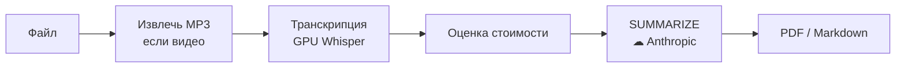

# Гайд по использованию EchoGist

Преврати локальный файл в MP3-дорожку или резюме за один запуск.

## Что это

EchoGist — консольный инструмент для Windows. Вход — аудио/видео файл или сохранённый
транскрипт. Выход — MP3 и/или резюме (PDF или Markdown).

Транскрипция идёт локально на GPU; резюмирование — один облачный вызов Anthropic. Личное
использование на своей машине: без логинов, истории и онлайн-источников.

## Что нужно

| Требование | Зачем | Примечание |
|---|---|---|
| **Windows** | целевая платформа | — |
| **Python 3.11.x** в PATH | запуск | строго `3.11.` — `run.bat` другую версию отклонит |
| **GPU NVIDIA + CUDA** | локальный Whisper | транскрипция идёт на GPU |
| **Ключ Anthropic** | только резюме | см. ниже |

ffmpeg ставить не нужно — он в комплекте (`imageio-ffmpeg`).

Ключ задай одним из двух способов:

- переменная окружения `ANTHROPIC_API_KEY`, или
- файл `config/secrets.toml` — скопируй `config/secrets.toml.example` и впиши ключ в
  `anthropic_api_key`.

> **Note** — без ключа MP3 и транскрипция работают. Не запустится только резюме.

## Первый запуск

```bat
run.bat
```

Первый запуск готовит всё сам: Python-окружение, зависимости, папки `output/`, разовую
загрузку модели Whisper (несколько ГБ с Hugging Face) и проверку GPU. Нужны интернет и время.
Дальше модель берётся локально и запуск идёт сразу в меню.

> **Warning** — закрылось с ошибкой? Читай сообщение над строкой `Startup aborted`. Окно ждёт
> нажатия клавиши, не пропадает мгновенно.

## Как устроен прогон



**SUMMARIZE** — единственный сетевой шаг. Всё слева от него локально и офлайн, включая оценку
стоимости. Сохранённый транскрипт входит на шаге C — поэтому повторное резюме пропускает A–C.

## Главное меню

Навигация: **↑/↓** двигают, **Enter** выбирает, **← Back** — шаг назад. **ESC** и **Ctrl-C**
выходят из приложения целиком.


| Пункт | Действие |
|---|---|
| **Local file** | взять локальный аудио/видео файл |
| **Saved transcript** | пере-резюмировать сохранённый транскрипт |
| **Settings** | язык, формат, модель, порог стоимости |
| **Exit** | выход |

## Сделать резюме или MP3

1. Выбери **Local file** и укажи файл в системном окне (помнит последнюю папку).
2. Выбери действие. Для **видео** MP3-дорожка сохраняется на любой ветке:

   | Действие | Что сохраняет |
   |---|---|
   | **MP3 only** | только MP3 |
   | **Summary** | MP3 + резюме + транскрипт (один облачный вызов) |
   | **Transcript** | MP3 + транскрипт (без облачного вызова) |

   Для входа, который **уже MP3**, веток две: **Summary** или **Transcript only**.

3. Следи за полосой прогресса (% и оставшееся время) на извлечении MP3 и транскрипции.
4. Подтверди стоимость. Дороже порога (`$0.50`) — спросит `y/n`; дешевле — идёт сразу.

Готовый результат EchoGist один раз открывает в Explorer (в фоне) по приоритету
**summaries → transcripts → audio**.

> **Note** — на ветках Summary и Transcript сбой извлечения MP3 не фатален: предупреждение и
> продолжение. Для **MP3 only** сбой возвращает в меню.

## Пере-резюмировать транскрипт

Транскрипт — это чекпоинт. Если резюме не удалось (пропал интернет, не было ключа), он уже
сохранён.

1. Выбери **Saved transcript**.
2. Возьми файл из списка `output/transcripts/` или впиши путь вручную.

Резюме пересоберётся **без повторной транскрипции** — платишь только за облачный вызов.

## Что внутри резюме

Резюме передаёт содержание записи: связная проза по ходу записи, главная идея, сквозные темы и
(если были) решения и пункты к выполнению.

Тайм-коды `[ЧЧ:ММ:СС]` в тексте показывают, к какому моменту записи относится фрагмент — по ним
удобно перемотать к первоисточнику.

## Настройки

**Settings** меняет пять параметров и пишет их в `config/settings.json`.


| Параметр | Значения | По умолчанию |
|---|---|---|
| **Summary language** | `ru` / `en` | `ru` |
| **Output format** | `pdf` / `md` | `pdf` |
| **Model tier** | `economy` / `balanced` / `flagship` | `economy` |
| **Cost confirm threshold** | сумма в USD | `$0.50` |
| **Auto-accept at or below threshold** | вкл / выкл | вкл |

При **Auto-accept = вкл** (по умолчанию) резюме дешевле порога запускается сразу. Выключи — и
перед платным вызовом появится пауза «нажми Enter», чтобы можно было отменить (Ctrl-C). Дороже
порога всегда спрашивает `y/n`, независимо от этой настройки.

Тарифы модели:

| Tier | Модель | Контекст | Цена вход / выход за 1М токенов |
|---|---|---|---|
| `economy` | Haiku | 200K | $1 / $5 |
| `balanced` | Sonnet | 1M | $3 / $15 |
| `flagship` | Opus | 1M | $5 / $25 |

> **Note** — модели, цены и текст промпта — данные, а не код. Правятся в `config/models.toml`.

> **Note** — иногда перед платным вызовом появляется предупреждение «prices unconfirmed»: у модели
> сменилось поколение, а цены ещё не перепроверены вручную, поэтому оценка может быть занижена. Оно
> не блокирует запуск и не меняет порог. Сверь цены на странице тарифов Anthropic и сними флаг
> `prices_unverified` в `config/models.toml`.

## Где лежат результаты

```text
output/
├── audio/         # извлечённые MP3
├── transcripts/   # полные транскрипты (.txt) — чекпоинт
└── summaries/     # резюме (.pdf / .md)
    └── raw/       # сырой .json — повторный рендер без оплаты
```

## Если что-то пошло не так

EchoGist не падает молча: при ошибке печатает сообщение и возвращает в меню.

| Сообщение | Что делать |
|---|---|
| **No Anthropic API key found (F3)** | Задай `ANTHROPIC_API_KEY` или заполни `config/secrets.toml`. Транскрипт сохранён — пере-резюмируй через **Saved transcript**. |
| **This transcript is too long… (F6)** | Часть транскрипта не влезает в контекст модели (проверка до сети). Выбери модель с бóльшим контекстом (`balanced`/`flagship`). Оплаты не было. |
| **Модель висит или падает при загрузке** | Нет связи с Hugging Face (бывает нужен VPN). Дождись интернета и перезапусти, либо положи файлы в `models/large-v3-int8_float16/` вручную. |
| **Python is not on PATH / needs 3.11.x** | Поставь Python 3.11 с python.org, перезапусти. |
| **Не находит ffmpeg** | Добавь ffmpeg в PATH или положи рядом с приложением. |

---

См. также: [README](../README.md) — обзор и возможности.
