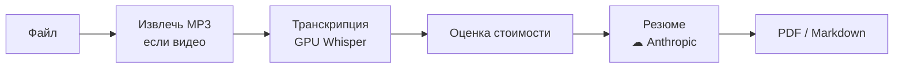

# Как пользоваться EchoGist

## Что это

Консольный инструмент для Windows. На входе — аудио- или видеофайл либо сохранённый
транскрипт. На выходе — MP3 и/или резюме в PDF или Markdown.

Транскрипция идёт локально на видеокарте, резюме собирает Anthropic — это один облачный
вызов. Без логинов, истории и онлайн-источников.

## Что нужно

| Требование | Зачем |
|---|---|
| **Windows** | целевая платформа |
| **Python 3.11.x** в PATH | другую версию `run.bat` отклонит |
| **GPU NVIDIA + CUDA** | локальная транскрипция |
| **Ключ Anthropic** | только для резюме |

ffmpeg ставить не нужно — он в комплекте.

Ключ задаётся одним из двух способов: переменная окружения `ANTHROPIC_API_KEY` или файл
`config/secrets.toml` (скопируй `config/secrets.toml.example` и впиши ключ в
`anthropic_api_key`).

> **Note** — без ключа MP3 и транскрипция работают. Не запустится только резюме.

## Первый запуск

```bat
run.bat
```

Первый запуск готовит всё сам: окружение, зависимости, папки `output/` и загрузку модели
Whisper (несколько ГБ). Нужны интернет и время. Дальше запуск идёт сразу в меню.

> **Warning** — если закрылось с ошибкой, читай сообщение над строкой `Startup aborted`.
> Окно ждёт нажатия клавиши и не пропадает мгновенно.

## Как устроен прогон



Сетевой шаг только один — резюме. Всё остальное, включая оценку стоимости, происходит на
твоей машине. Сохранённый транскрипт подставляется вместо шагов A–C, поэтому повторное
резюме начинается сразу с оценки.

## Главное меню

**↑/↓** двигают, **Enter** выбирает, цифра выбирает строку по номеру, **← Back** — шаг
назад. **ESC** и **Ctrl-C** выходят из приложения; единственное исключение — прогон по
папке (конвертация, транскрипция и резюме): там Ctrl-C останавливает прогон, печатает
частичный отчёт и возвращает в меню.

| Пункт | Действие |
|---|---|
| **Single file** | одна запись или один сохранённый транскрипт |
| **Folder** | все файлы одной папки, тем же набором действий |
| **Settings** | язык, формат, модель, порог стоимости, воркеры |
| **Exit** | выход |

Меню — это два модуля, которые различаются только масштабом входа: один файл или папка.
Вопрос про результат у них общий, поэтому папка умеет ровно то же, что и одиночный файл.
**Single file** сначала спрашивает, с чего начинаем: **Audio or video file** или
**Saved transcript**.

## Резюме или MP3 из одного файла

1. Выбери **Single file → Audio or video file** и укажи файл в системном окне (оно
   помнит последнюю папку).
2. Выбери действие. Для **видео** MP3-дорожка сохраняется в любом случае:

   | Действие | Что сохраняет |
   |---|---|
   | **MP3 only** | только MP3 |
   | **Summary** | MP3 + резюме + транскрипт |
   | **Transcript** | MP3 + транскрипт, без облачного вызова |

   Если на входе уже MP3, вариантов два: **Summary** или **Transcript only**.

3. Извлечение MP3 и транскрипция показывают процент и оставшееся время.
4. Подтверди стоимость. Дороже порога (`$0.50`) — спросит `y/n`, дешевле — пойдёт сразу.

В конце EchoGist один раз открывает папку с результатом — резюме, если оно есть, иначе
транскрипт, иначе аудио.

> **Note** — на ветках Summary и Transcript сбой извлечения MP3 не фатален: будет
> предупреждение, и прогон продолжится. Для **MP3 only** сбой возвращает в меню.

## Папка целиком

Выбери **Folder** и укажи папку. Дальше — всё то же, что и для одного файла, но сразу для
всех записей внутри, включая вложенные подпапки.

### Отчёт по папке показывается сам

Сразу после выбора папки EchoGist её обходит и показывает: сколько файлов и часов, по
папкам; во сколько обойдётся резюме; какие имена повторяются; что не удалось прочитать.
Отчёт бесплатный, офлайновый и ничего не пишет, кроме кэша длительностей, — он появляется
ДО вопроса «что сделать», потому что именно на него этот вопрос и опирается.

Цена в отчёте — **проекция по длительности**, с запасом вверх (примерно 1.5 счёта на
единственном измеренном курсе). Точную сумму назовут позже, по реальным транскриптам.
Ctrl-C прерывает обход: то, что уже прочитано, останется в отчёте и в кэше.

Пустая папка просто возвращает в меню.

**Папку `output/` выбрать нельзя** — и вложенную в неё тоже. Всё, что там лежит, EchoGist
сделал сам, так что прогон по ней заново расшифровал бы и заново оплатил уже готовое, а
результаты легли бы под именами с двойной датой. Приложение отказывается сразу, до обхода,
и говорит, чем это заменить: чтобы получить резюме из готового транскрипта, возьми
**Saved transcript**; чтобы обработать записи — папку, из которой они взяты.

### Действия

| Действие | Что делает |
|---|---|
| **MP3 only** | конвертирует всё в MP3. Офлайн, бесплатно, несколько файлов сразу |
| **Transcript** | транскрибирует всё. До сети этот прогон не доходит вообще |
| **Summary** | транскрибирует всё, потом резюмирует |

**Summary** идёт в две фазы: сначала бесплатная локальная транскрипция всей папки, и
только потом — ОДНА точная оценка и ОДИН вопрос про деньги на весь прогон. Подтверждения
на каждый файл нет: ради этого прогон и существует. Файлы, у которых резюме уже есть, в
счёт не попадают; сохранённые транскрипты переиспользуются, а не пересчитываются.

MP3 на прогоне по папке тоже сохраняются — вопрос задаётся один раз, по умолчанию «да»,
и не появляется, если извлекать не из чего.

Один битый файл не роняет прогон: он попадает в таблицу с причиной, остальные
досчитываются. В конце — отчёт по файлам с ценой каждого, потраченное время и сравнение
оценки со счётом.

> **Ctrl-C здесь останавливает прогон, а не приложение.** Готовые артефакты остаются на
> диске, печатается частичный отчёт, и ты возвращаешься в меню.

Если прогон оборвался, повторный запуск не оплачивает заново то, что уже сделано:
транскрипты берутся с диска, а фазы резюме, дошедшие до конца, восстанавливаются из
`raw/.resume/`.

Сколько файлов конвертируется одновременно, задаёт **Settings → Batch MP3 workers**.

Осознанно сжать один MP3 можно через **Single file → Audio or video file →
Re-encode to a smaller MP3**.

## Пере-резюмировать транскрипт

Транскрипт сохраняется всегда, поэтому неудачное резюме (пропал интернет, не было ключа)
не стоит второй транскрипции.

1. Выбери **Single file → Saved transcript**.
2. Возьми файл из списка `output/transcripts/` или впиши путь вручную.

Резюме пересоберётся без повторной транскрипции — платишь только за облачный вызов.

## Что внутри резюме

Связная проза по ходу записи, главная идея, сквозные темы и — если они были — решения и
пункты к выполнению.

Тайм-коды `[ЧЧ:ММ:СС]` в тексте показывают, к какому моменту записи относится фрагмент: по
ним удобно перемотать к первоисточнику.

## Настройки

**Settings** меняет шесть параметров и пишет их в `config/settings.json`.


| Параметр | Значения | По умолчанию |
|---|---|---|
| **Summary language** | `ru` / `en` | `ru` |
| **Output format** | `pdf` / `md` | `pdf` |
| **Model tier** | `economy` / `balanced` / `flagship` | `economy` |
| **Cost confirm threshold** | сумма в USD | `$0.50` |
| **Auto-accept at or below threshold** | вкл / выкл | вкл |
| **Batch MP3 workers** | `1`–`16` | `4` (не больше числа ядер) |

**Batch MP3 workers** — сколько файлов конвертируется одновременно. `1` — строго по
очереди. Больше четырёх обычно не ускоряет.

При **Auto-accept = вкл** резюме дешевле порога запускается сразу. Выключи — и перед
платным вызовом появится пауза «нажми Enter», чтобы можно было отменить. Дороже порога
спрашивает всегда.

Тарифы модели:

| Tier | Модель | Контекст | Цена вход / выход за 1М токенов |
|---|---|---|---|
| `economy` | Haiku | 200K | $1 / $5 |
| `balanced` | Sonnet | 1M | $3 / $15 |
| `flagship` | Opus | 1M | $5 / $25 |

> **Note** — модели, цены и текст промпта правятся в `config/models.toml`, без изменения кода.

### Что говорится про готовое резюме

Часть строк в консоли — просто ход работы, но некоторые требуют действия и печатаются
громко. Их стоит дочитывать:

| Строка | Что она значит |
|---|---|
| `Validated anchors: N exact, M snapped, K dropped` | тайм-коды сверены с записью: точные, подвинутые в пределах 2 секунд и выброшенные. Выброшенный — это место, которое модель процитировала мимо |
| `Nothing here cites the recording` | у куска нет ни одной ссылки на запись, проверить его по записи нельзя |
| `Reconcile returned no title` / `no core idea` / `no key skill` / `no self-check questions` | сводящий вызов вернулся неполным. Документ на месте, но блок сути неполон — при желании пере-резюмируй из сохранённого транскрипта |
| `Phase N/M … came back empty` | фаза вернулась без текста, то есть её кусок записи выпал бы из документа. Файл падает намеренно. По окончании прогона EchoGist спросит: `N file(s) stopped on an empty phase. Retry from the saved transcript?` — ответ по умолчанию «да», то есть Enter повторяет. Согласие повторяет только упавшие файлы и оплачивает только пропавшую фазу; спрашивается один раз, вторая пустая фаза уже не предлагается |
| `Foreign script in the summary` | в текст вклинились символы чужой письменности |
| `…% of its letters are …, not …` | документ написан не на том языке, который запрашивался, и это не отдельная цитата, а весь текст |

> **Note** — предупреждение «prices unconfirmed» означает, что у модели сменилось поколение,
> а цены ещё не перепроверены вручную, так что оценка может быть занижена. Запуск оно не
> блокирует. Сверь цены у Anthropic и сними флаг `prices_unverified` в `config/models.toml`.

## Где лежат результаты

```text
output/
├── audio/         # извлечённые MP3
├── transcripts/   # полные транскрипты (.txt)
├── logs/          # по файлу на запуск — стенограмма консоли
└── summaries/     # резюме (.pdf / .md)
    └── raw/       # сырой .json — повторный рендер без оплаты
        └── .resume/   # фазы, дошедшие до конца перед сбоем
```

Папки плоские: группировка живёт в ИМЕНИ файла, а не в подкаталогах. Резюме называется
`<дата>-<имя записи>-<заголовок>.pdf`, транскрипт — `<дата>-<имя записи>-<отпечаток>.txt`.
Поэтому сортировка по имени сама раскладывает файлы по прогонам, а внутри прогона — по
занятиям, и два прохода по одному курсу видно как два блока. Дата у резюме — дата ПРОГОНА,
одна на всю папку: прогон на 18 часов иначе разъехался бы через полночь на две даты.

## Если что-то пошло не так

При ошибке EchoGist печатает сообщение и возвращает в меню.

| Сообщение | Что делать |
|---|---|
| **No Anthropic API key found (F3)** | Задай `ANTHROPIC_API_KEY` или заполни `config/secrets.toml`. Транскрипт сохранён — пере-резюмируй через **Saved transcript**. |
| **This transcript is too long… (F6)** | Транскрипт не влезает в контекст модели. Возьми модель с бóльшим контекстом (`balanced` / `flagship`). Оплаты не было. |
| **Модель висит или падает при загрузке** | Нет связи с Hugging Face (иногда нужен VPN). Дождись интернета и перезапусти либо положи файлы в `models/large-v3-int8_float16/` вручную. |
| **Python is not on PATH / needs 3.11.x** | Поставь Python 3.11 с python.org и перезапусти. |
| **Не находит ffmpeg** | Добавь ffmpeg в PATH или положи рядом с приложением. |
| **Phase N/M … came back empty** | Фаза вернулась пустой, её кусок записи не попал бы в документ. Транскрипт сохранён — запусти **Saved transcript** ещё раз: уже сделанные фазы не оплачиваются повторно. На прогоне по папке падает только этот файл, остальные досчитываются. |
| **… is EchoGist's own output folder** | Выбрана папка с собственными артефактами. Для резюме из готового транскрипта — **Saved transcript**; для записей — папка, из которой они взяты. |

---

См. также: [README](../README.md) — обзор и возможности.
